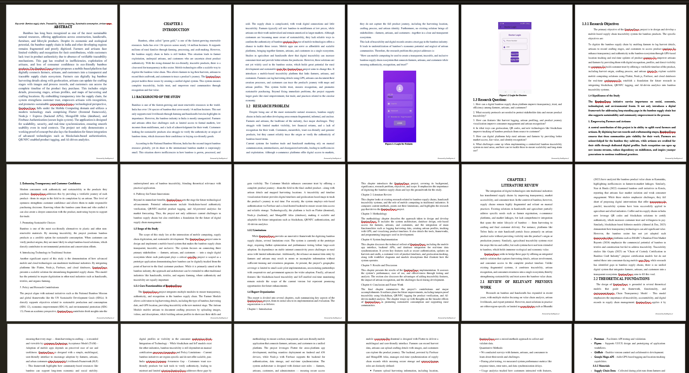

# DocPhysics AI

<div align="center">

[](https://www.python.org/)
[](https://reactjs.org/)
[](https://fastapi.tiangolo.com/)
[](https://ai.google.dev/)
[](https://opensource.org/licenses/MIT)

**Eliminate the "Friction of Physics" in Academic Formatting.**

DocPhysics AI automates the tedious, manual labor of Word document formatting. It bridges the gap between raw content and submission-ready precision by enforcing strict pagination, structural, and layout rules.

[Explore Features](#core-capabilities) • [Technical Foundation](#technical-foundation) • [Getting Started](#installation-and-setup)

</div>

---

## 💡 The Problem
Researchers, students, and professionals lose hours fixing Word formatting issues that software tools and grammar checkers cannot solve—such as **broken page flow**, **orphan headings**, **floating images**, **extra blank pages**, and **misaligned sections**. These "physics" errors often lead to paper rejections, regardless of content quality. 

**DocPhysics AI** fills this critical gap by automatically enforcing professional pagination rules, allowing authors to focus on research instead of fighting Microsoft Word.

## 🚀 Core Capabilities

- **🧠 Intelligent Pagination Logic**: Automatically resolves orphan headings, widow lines, and awkward page breaks to ensure professional document flow.
- **🖼️ Smart Asset Management**: Ensures images, tables, and captions are anchored correctly and positioned relative to their textual references.
- **🔍 AI-Powered Structural Analysis**: Leverages Google Gemini to identify semantic inconsistencies and suggest structural hierarchy improvements.
- **📑 Journal-Standard Directives**: Applies consistent typography (Times New Roman) and hierarchical heading styles aligned with IEEE/ACM/APA standards.
- **🔗 Reference & Citation Integrity**: Scans for missing citations and verifies bibliographic formatting against the document body.

## 📸 Visual Documentation

<div align="center">
  <h3>Primary Workspace</h3>
  
  <p><em>Professional interface designed for high-throughput document analysis.</em></p>
</div>

<br />

<div align="center">
  <table width="100%">
    <tr>
      <td width="50%" align="center">
        <h4>AI Analysis Engine</h4>
        
      </td>
      <td width="50%" align="center">
        <h4>Document Reconstruction</h4>
        
      </td>
    </tr>
  </table>
  <p><em>Real-time discrepancy detection and automated restructuring in action.</em></p>
</div>

---

## 🛠️ Technical Foundation

DocPhysics AI is built on a modular, high-performance stack designed for reliability and scalability.

| Component | Technology | Role |
| :--- | :--- | :--- |
| **Backend** | FastAPI / Python | High-speed REST API & Document Processing |
| **Frontend** | React / Vite | Modern, responsive UX/UI |
| **Styling** | Tailwind CSS | Utility-first responsive design |
| **Processing** | Python-Docx | Low-level DOCX XML manipulation |
| **Intelligence** | Google Gemini Pro | Semantic analysis and structural reasoning |

---

## ⚙️ Installation and Setup

### Prerequisites
*   **Python:** 3.9+ 
*   **Node.js:** 16+ 
*   **API Key:** Google Gemini Pro credentials

### 1. Backend Service
```bash
# Navigate and Setup
cd backend
python -m venv venv
.\venv\Scripts\activate  # Windows
# source venv/bin/activate # Unix

# Install & Configure
pip install -r requirements.txt
echo "GEMINI_API_KEY=your_api_key_here" > .env

# Run
uvicorn main:app --reload
```

### 2. Frontend Application
```bash
# Navigate and Install
cd frontend
npm install

# Build & Run
npm run dev
```

---

## 📝 License
This project is licensed under the MIT License - see the [LICENSE](LICENSE) file for details.

## 🤝 Contribution
Designed for the academic and research community. Feedback and contributions are welcome via Pull Requests.

